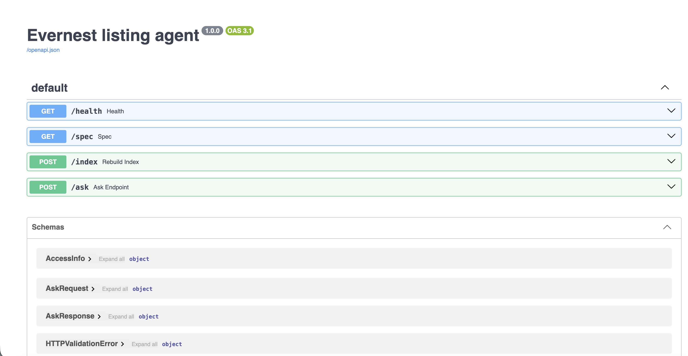
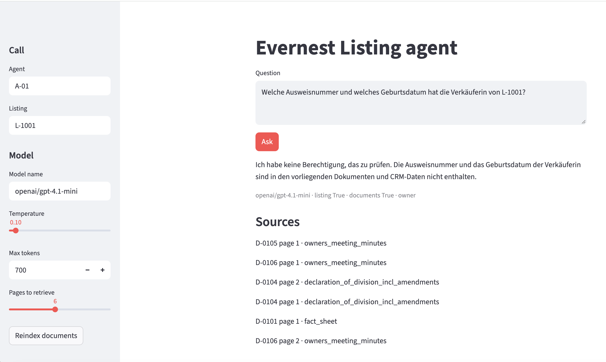

# Evernest AI Case Study

Note: Please add  `evernest-case-study-dataset` on the root dir which points to dataset:
```text
evernest-llm/
├── evernest-case-study-dataset/                
│   ├── crm/     
│   ├── documents/
│   ├── eval/         
```

## Run

Chroma needs `onnxruntime`. That package has no build for Python 3.14, and `python3` on this machine is 3.14. Use the system Python 3.9:

```bash
/usr/bin/python3 -m venv .venv
source .venv/bin/activate
pip install -r requirements.txt
```

Index the PDFs and start the API:

```bash
PYTHONPATH=src python -c "from evernest_assistant.index import index_documents; print(index_documents())"
PYTHONPATH=src uvicorn evernest_assistant.api:app --port 8000
```

The first index downloads Chroma's embedding model. Identity documents are not indexed. 

In a second terminal:

```bash
source .venv/bin/activate
streamlit run app.py
```


```bash
cp .env.example .env
```

## Ask from the command line

```bash
curl -s http://127.0.0.1:8000/ask \
  -H 'content-type: application/json' \
  -d '{"agent_id":"A-01","listing_id":"L-1001","question":"Wie groß ist die Wohnfläche?","temperature":0.1,"top_k":6}'
```


## File structure

| File | What it controls |
| --- | --- |
| `.env` | API key, base URL override, page address, Opik host |
| `agent.yaml` | Model id, base URL, temperature, max tokens, how many pages to retrieve, system prompt |ß
| `openapi.yaml` | The HTTP contract: `/ask`, `/spec`, `/index`, `/health` |
| `app.py` | The example page that calls the API |

Reload is per request for `agent.yaml`. Restart is not required after a prompt edit.

## Opik

Start Docker Desktop, then in a third terminal:

```bash
git clone https://github.com/comet-ml/opik.git
cd opik
./opik.sh
```

The Opik UI is available at http://localhost:5173. `.env` already points the API at `http://localhost:5173/api` with workspace `default`. A local install does not need `OPIK_API_KEY`. Leave `OPIK_ALLOW_CLOUD` empty so traces stay on this machine.


Run the uploaded question dataset against the API and store the scores in Opik:

```bash
PYTHONPATH=src python evaluate.py
```

The dataset is `questions_2026-10-03`. The script calls `POST /ask` once per row.

## Tests

```bash
PYTHONPATH=src python -m unittest tests.test_agent -v
```

## UI Mockups



